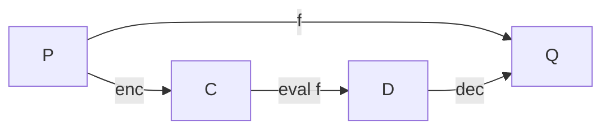

# Taxonomy of Fully Homomorphic Encryption

## Introduction
Fully Homomorphic Encryption (FHE) has a reputation for being
complicated and obscure. While it's certainly true that most FHE
schemes are more complicated than, say, a CCA secure public-key
encryption scheme, there's nothing inherently complicated about FHE in
itself. The goal of this taxonomy (and its associated pages) is to
make FHE more accessible to both software engineering community as
well as "data science" community.

At a very high level, fully homomorphic encryption allows
_computation on encrypted data_. But computation on encrypted data
can mean different things to different people. For example, a
commercially popular paradigm, called _Trusted Execution_, allows
one to keep data encrypted at all times, except inside
a trusted execution hardware unit, where data is _first
decrypted_ and then processed as usual. In this model,
the hardware is _trusted_ solely because the user has decided to
trust it --- not because there's some incontrovertible proof that
the device is indeed trustworthy! Indeed, many (if not most) trusted
execution environments are not trustworthy.

In Fully Homomorphic Encryption, on the other hand, not even a single
bit of data is ever decrypted. Indeed, FHE provides a mathematical
framework and associated guarantees about (a) what qualifies as
encrypted data, and (b) how to perform computation on that encrypted
directly, without every decrypting it! This can be summarized in the
diagram below:

Suppose that an arbitrary computable function $f$ takes $P$ as input and produces $Q$ as output, i.e., \( Q = f(P) \). Then FHE provides:

1. An encryption function \( \text{enc}(k, \cdot) \), that given a (public) key $k$, can encrypt plaintext \( P \) into ciphertext \( C \),
2. A decryption function  \( \text{dec}(k', \cdot) \), that given a (private) key $k'$, can  decrypt ciphertext \( D \) back into plaintext \( Q \), such that $ Q = \text{dec}(k', \text{enc}(k, Q) )$ for all $Q$, and
3. A method $\text{eval}(f,\cdots)$ that given an arbitrary computable function $f$, some ciphertext $C$ that's the _encryption of the inputs_ for $f$, can produce a ciphertext $D$, which is the encryption of the output of $f$. In addition, the output $D$ should only depend upon the number of bits of the output of $f$, not on $f$ itself. That is, if two distinct functions, $f_1$ and $f_2$, both produce output of exactly same $k$ bits, then $\text{eval}(f_1,\cdots)$ and $\text{eval}(f_2,\cdots)$, must have same-length output. In other words, the evaluation process should really evaluate $f$ on the encrypted input.

## Computational Model

## Encryption Scheme Requirements

## Evaluation and Compactness